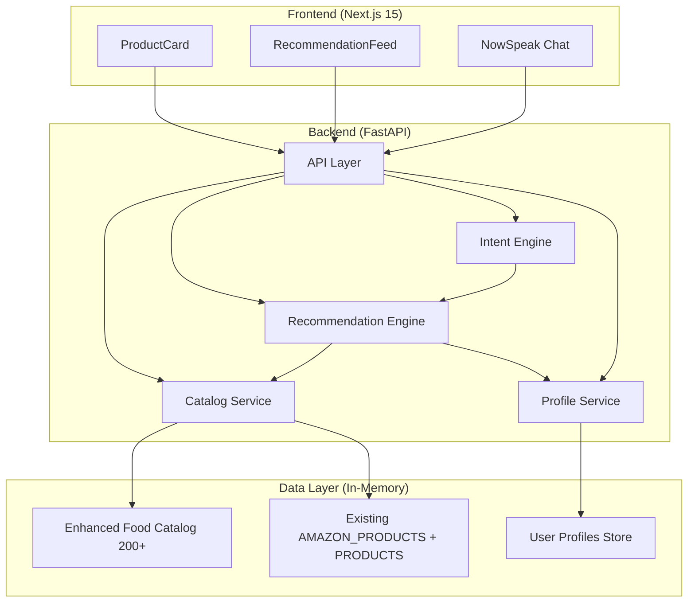

# Design Document: Amazon Polish Enhancements

## Overview

This design extends the existing Amazon Now MVP to deliver a polished, personalized food shopping experience. All changes are additive — existing services, components, routes, and APIs are preserved and enhanced in-place.

Key enhancements:
- Expanded product catalog (200+ food products) with structured ingredient/dietary/allergen metadata
- Dietary-aware product cards with explainable match-reason badges
- Comprehensive allergy safety filtering across all product surfaces
- Alternative product recommendations for filtered items
- Chat-intent-driven dynamic recommendations
- Amazon-style UI polish (badges, carousels, ingredient expandable, discount display)

## Architecture

The existing architecture is maintained with enhancements layered onto existing modules:



**Architecture Decisions:**
- **In-place extension**: No new services or infrastructure. All changes modify existing modules.
- **Dual-mode filtering**: Supports both structured `allergen_tags` and legacy `tags` field for backward compatibility.
- **In-memory catalog merge**: New enhanced food catalog loaded alongside existing product sources into a unified `ALL_PRODUCTS` list.
- **Reason computation at recommendation time**: Reasons are computed when building recommendation responses, not stored on products.

## Components and Interfaces

### Backend Components

#### Product Data Schema Extension (`models/product.py`)

**Current State**: Products have a flat `tags` string field used for keyword search. No structured ingredient, dietary, or allergen data.

**Extension**:
```python
class ProductCard(BaseModel):
    # ... existing fields preserved ...
    ingredients: List[str] = []           # 1-50 items, each <= 100 chars
    dietary_tags: List[str] = []          # from allowed set
    allergen_tags: List[str] = []         # from allowed set
    nutrition_summary: Optional[Dict[str, Any]] = None  # partial dict allowed
```

Allowed `dietary_tags` values: Vegetarian, Vegan, Gluten-Free, Dairy-Free, Nut-Free, Keto, High-Protein, Low-Sugar, Organic

Allowed `allergen_tags` values: Nuts, Dairy, Gluten, Soy, Shellfish, Eggs

#### Enhanced Food Catalog Loader (`db/food_catalog.py`)

New module that loads 200+ structured food products from `backend/data/food_catalog_enhanced.json`. Integrated into `catalog.py`:
```python
ALL_PRODUCTS: list[dict] = AMAZON_PRODUCTS + FOOD_ENHANCED_PRODUCTS + PRODUCTS
```

#### Catalog Service Enhancement (`services/catalog.py`)

**Format function extension**:
```python
def _format(p: dict) -> dict:
    return {
        # ... existing fields ...
        "ingredients": p.get("ingredients", []),
        "dietary_tags": p.get("dietary_tags", []),
        "allergen_tags": p.get("allergen_tags", []),
        "nutrition_summary": p.get("nutrition_summary", None),
    }
```

Backward compatibility: The `tags` field is auto-generated from ingredients + dietary_tags + allergen_tags + name for new products, preserving keyword search.

#### Dual-Mode Filtering (`services/profile_service.py`)

```python
def filter_products(products: List[dict], exclusion_set: Optional[Set[str]]) -> List[dict]:
    if not exclusion_set:
        return products
    safe = []
    for product in products:
        # Mode 1: Structured allergen_tags
        product_allergens = [a.lower() for a in product.get("allergen_tags", [])]
        allergen_conflict = any(
            kw in allergen for allergen in product_allergens for kw in exclusion_set
        )
        # Mode 2: Ingredient-level check
        ingredients_text = " ".join(product.get("ingredients", [])).lower()
        ingredient_conflict = any(kw in ingredients_text for kw in exclusion_set)
        # Mode 3: Legacy tags check (backward compat)
        tags_lower = product.get("tags", "").lower()
        tags_conflict = any(kw in tags_lower for kw in exclusion_set)

        if not (allergen_conflict or ingredient_conflict or tags_conflict):
            safe.append(product)
    return safe
```

#### Alternative Recommendations (`services/recommendation.py`)

```python
def find_alternatives(filtered_products: List[dict], exclusion_set: Set[str], safe_products: List[dict]) -> List[dict]:
    alternatives = []
    for product in filtered_products:
        conflict_keyword = _find_conflict_keyword(product, exclusion_set)
        alt = _find_safe_alternative(product, conflict_keyword, safe_products)
        if alt:
            alt["reason"] = f"Recommended Alternative — try instead of {product['name']}"
            alt["is_alternative"] = True
            alt["replaces"] = product["name"]
            alternatives.append(alt)
    return alternatives
```

Selection criteria: same category, in-stock, passes exclusion filter, overlapping non-excluded tags.

#### Explainable Reason Computation (`services/recommendation.py`)

```python
def _compute_reason(product: dict, user_profile: dict, intent_query: str | None) -> str:
    reasons = []
    if intent_query:
        reasons.append(f'Recommended based on your chat: "{intent_query}"')
    user_diet_tags = user_profile.get("diet_tags", [])
    product_diet_tags = product.get("dietary_tags", [])
    for tag in user_diet_tags:
        if tag.lower() in [t.lower() for t in product_diet_tags]:
            reasons.append(f"Matches your {tag} preference")
            break
    user_allergens = user_profile.get("allergen_tags", [])
    if user_allergens and not _has_allergen_conflict(product, user_allergens):
        reasons.append(f"Safe for your allergy settings")
    if "High-Protein" in product.get("dietary_tags", []):
        reasons.append("High protein")
    return reasons[0] if reasons else "Recommended for you"
```

Priority order: intent > dietary match > allergen safety > nutritional > generic fallback.

#### Enhanced Intent Engine (`services/intent_engine.py`)

Expanded keyword map for food-specific intents:
```python
KEYWORD_MAP = {
    "fever": {"query": "soup hydration fruits light food recovery", "category": ""},
    "protein": {"query": "high protein tofu paneer lentils chickpeas", "category": ""},
    "coffee": {"query": "coffee caffeine beverages breakfast", "category": "beverages"},
    "vegetarian": {"query": "vegetarian plant-based", "category": ""},
    # ... more food intent mappings
}
```

Broader search when intent is active (limit=16 for diversity), with category filter removed as fallback.

### Frontend Components

#### ProductCard Enhancement (`components/ProductCard/index.tsx`)

Grid card layout:
```
┌─────────────────────┐
│  [Image]            │
│  [Discount badge]   │
├─────────────────────┤
│  Product Name (2 lines max)
│  500g               │
│  ✓ Vegetarian       │  ← green dietary badge
│  ✓ Nut-Free         │  ← blue safety badge
│  "Matches your..."  │  ← reason text (grey italic)
│  ₹185  ₹220        │
│           [+]       │
│  ▸ Ingredients      │  ← expandable tooltip
└─────────────────────┘
```

Badge component: colored chips from `dietary_tags` and allergen safety status.
- Green: dietary match (✓ Vegetarian, ✓ Vegan, ✓ Gluten Free)
- Blue: allergen safe (✓ Nut-Free, ✓ Dairy-Free)
- Orange: alternative indicator (🔄 Recommended Alternative)

#### Frontend Product Type (`lib/api.ts`)

```typescript
export type Product = {
  // ... existing fields ...
  ingredients?: string[];
  dietary_tags?: string[];
  allergen_tags?: string[];
  nutrition_summary?: { calories?: number; protein?: string; carbs?: string; fat?: string };
  is_alternative?: boolean;
  replaces?: string;
};
```

All new fields are optional — existing product responses remain valid.

### API Interface Changes

**GET /api/v1/recommendations** (modified):
- Response adds per-product: `ingredients`, `dietary_tags`, `allergen_tags`, `nutrition_summary`, `is_alternative`, `replaces`
- New lane: `alternatives` (list of alternative products)

**GET /api/v1/products** (modified):
- Response products include new structured fields
- No parameter changes

**GET /api/v1/products/{product_id}/alternatives** (new):
- Returns safe alternatives for a specific product given a user's profile
- Query params: `user_id`

## Data Models

### Product Schema (Extended)

```json
{
  "id": "food_001",
  "name": "Organic Rolled Oats 1kg",
  "category": "breakfast",
  "price": 185.0,
  "mrp": 220.0,
  "discount_percent": 16,
  "unit": "pack",
  "eta_min": 22,
  "in_stock": true,
  "image_url": "https://placehold.co/200x200/...",
  "tags": "oats breakfast cereal fiber whole grain organic",
  "ingredients": ["Whole Grain Oats"],
  "dietary_tags": ["Vegetarian", "Vegan", "High-Protein"],
  "allergen_tags": ["Gluten"],
  "nutrition_summary": {"calories": 389, "protein": "13g", "carbs": "66g", "fat": "7g"}
}
```

**Field Constraints:**
| Field | Type | Constraints |
|-------|------|-------------|
| `ingredients` | `List[str]` | 1-50 items, each <= 100 chars |
| `dietary_tags` | `List[str]` | 0-20 items from allowed set |
| `allergen_tags` | `List[str]` | 0-20 items from allowed set |
| `nutrition_summary` | `Optional[Dict]` | Partial keys allowed: calories, protein, carbs, fat |
| `tags` | `str` | Preserved unchanged for backward compatibility |

**Defaults for missing fields:**
- `ingredients` → `[]`
- `dietary_tags` → `[]`
- `allergen_tags` → `[]`
- `nutrition_summary` → `null`

### User Profile (Existing - Unchanged)

```python
{
  "user_id": str,
  "diet_tags": List[str],        # e.g., ["Vegetarian", "Gluten-Free"]
  "allergen_tags": List[str],    # e.g., ["Nuts", "Dairy"]
  "custom_exclusions": str,      # comma-separated keywords
}
```

### Recommendation Response (Extended)

```python
{
  "lanes": {
    "trending": [ProductCard, ...],
    "for_you": [ProductCard, ...],
    "now_suggestions": [ProductCard, ...],   # intent-driven
    "alternatives": [ProductCard, ...]        # NEW: safe alternatives
  },
  "filtered_count": int,          # number of products removed by safety filter
  "profile_active": bool
}
```

### Chat Intent Model (Unchanged)

```python
{
  "query": str,      # 1-200 characters
  "category": str    # optional category filter
}
```

## Correctness Properties

*A property is a characteristic or behavior that should hold true across all valid executions of a system — essentially, a formal statement about what the system should do. Properties serve as the bridge between human-readable specifications and machine-verifiable correctness guarantees.*

### Property 1: Universal Filtering Invariant

*For any* user with a non-empty exclusion set and *for any* product surface (recommendations, category browse, search, chat suggestions), no product in the response SHALL contain any keyword from the user's exclusion set in its `tags` field, `ingredients` list, or `allergen_tags` list (case-insensitive substring match).

**Validates: Requirements 3.1, 3.2, 3.3, 3.4**

### Property 2: Product Data Consistency

*For any* product in the catalog, if its `ingredients` field contains an item associated with a known allergen, then `allergen_tags` SHALL include the corresponding allergen; AND if `dietary_tags` includes a restrictive tag (Vegan, Gluten-Free, Dairy-Free, Nut-Free), then `ingredients` SHALL NOT contain any contradicting ingredient.

**Validates: Requirements 1.6, 1.7**

### Property 3: Alternative Product Safety

*For any* product marked as `is_alternative: true`, that product SHALL be in the same category as the product it replaces, SHALL have `in_stock: true`, AND SHALL pass the requesting user's exclusion set filter (no keyword from the exclusion set appears in its tags, ingredients, or allergen_tags).

**Validates: Requirements 4.1, 4.3, 4.5**

### Property 4: Reason Specificity

*For any* product in a personalized recommendation response: if recommended due to dietary match, the `reason` field SHALL reference the specific dietary tag; if recommended due to allergen safety, it SHALL reference the specific allergen; if recommended due to chat intent, it SHALL include the original query text; if recommended for nutritional properties, it SHALL name the specific attribute. The `reason` field SHALL never be empty or null.

**Validates: Requirements 5.1, 5.2, 5.3, 5.4, 5.7**

### Property 5: Reason Length Constraint

*For any* product displayed on a Product Card, the `reason` text shown to the user SHALL be at most 120 characters. If the computed reason exceeds 120 characters, it SHALL be truncated with an ellipsis.

**Validates: Requirements 5.6**

### Property 6: Badge Correctness

*For any* product and user profile combination, the Product Card SHALL display a dietary match badge ONLY when the product's tags contain none of the exclusion keywords for that diet category; SHALL display a safety badge ONLY when the product has no allergen conflict; SHALL display a custom exclusion badge ONLY when no custom exclusion keywords match; AND the total number of badges displayed SHALL NOT exceed 3.

**Validates: Requirements 2.1, 2.2, 2.3, 2.4, 2.7**

### Property 7: Intent Diversity

*For any* two unrelated chat intents (intents with no overlapping query terms), the resulting product recommendation lists SHALL have at least 60% different product IDs.

**Validates: Requirements 6.7**

### Property 8: Schema Field Validation

*For any* product in the catalog, the `ingredients` field SHALL be a list of 1-50 strings (each <= 100 chars), `dietary_tags` SHALL contain only values from the allowed set, `allergen_tags` SHALL contain only values from the allowed set, and if `nutrition_summary` is present it SHALL accept any subset of keys (calories, protein, carbs, fat) with missing keys treated as null.

**Validates: Requirements 1.2, 1.3, 1.4, 8.1, 8.5, 8.6**

### Property 9: Backward Compatibility

*For any* product with a legacy `tags` field, text-based search queries using `tags` SHALL produce identical results before and after the schema extension, and allergen exclusion SHALL match against BOTH the structured `allergen_tags` list AND the legacy `tags` field.

**Validates: Requirements 8.2, 8.3**

### Property 10: Discount Display Accuracy

*For any* product with a discount, the Product Card SHALL display the original price (MRP) with strikethrough, the discounted price as primary, and a percentage-off badge showing the correct integer discount percentage (rounded to nearest whole number).

**Validates: Requirements 7.4**

### Property 11: Intent Relevance

*For any* valid chat intent producing a non-empty `now_suggestions` lane, at least 60% of returned products SHALL contain terms from the intent query in their name, tags, or category.

**Validates: Requirements 6.3**

### Property 12: Section Header Length

*For any* recommendation section header displayed in the Recommendation Feed, the header text SHALL NOT exceed 60 characters.

**Validates: Requirements 7.2**

## Error Handling

| Scenario | Behavior | Requirement |
|----------|----------|-------------|
| Profile service unreachable / user_id missing | Return unfiltered results, `profile_active: false` | 3.7 |
| Profile retrieval exceeds 2 seconds | Render product cards without personalized badges, show informational labels | 2.6 |
| Intent engine fails structured extraction | Fall back to keyword-based intent using original message as query | 6.2 |
| No products match intent query + category | Remove category filter, return up to 8 general products | 6.8 |
| All products in a lane filtered by exclusion set | Backfill with safe products from broader catalog up to original lane size | 3.5 |
| No safe alternative exists in same category | Omit alternative suggestion entirely (no placeholder) | 4.4 |
| Product image fails to load | Display category-specific placeholder at same dimensions | 7.6 |
| Reason cannot be determined | Assign generic "Recommended for you" | 5.7 |
| Structured fields missing on legacy product | Default to empty list / null; filtering uses legacy tags only | 8.5 |
| Partial nutrition_summary | Accept partial dict, treat missing keys as null | 8.6 |

## Testing Strategy

### Property-Based Tests (Hypothesis - Python)

Property-based testing is appropriate for this feature because the core logic involves pure filtering functions, data validation, and transformation functions with large input spaces. We use the [Hypothesis](https://hypothesis.readthedocs.io/) library.

**Configuration**: Minimum 100 iterations per property test.

**Tag format**: `Feature: amazon-polish-enhancements, Property {N}: {property_text}`

| Property | Test Approach |
|----------|---------------|
| 1: Filtering Invariant | Generate random exclusion sets + product lists, verify no unsafe product passes filter on any surface |
| 2: Data Consistency | Generate random products with ingredients/tags, verify allergen and dietary consistency |
| 3: Alternative Safety | Generate filtered products + safe catalog, verify alternatives are same-category, in-stock, pass filter |
| 4: Reason Specificity | Generate products with various recommendation contexts, verify reason references correct context |
| 5: Reason Length | Generate random reason strings of varying length, verify truncation at 120 chars |
| 6: Badge Correctness | Generate random product-profile pairs, verify correct badge inclusion/exclusion |
| 7: Intent Diversity | Generate pairs of unrelated intents, verify >= 60% product difference |
| 8: Schema Validation | Generate random product data, verify field type and constraint compliance |
| 9: Backward Compat | Generate products with/without new fields, verify tags-based operations unchanged |
| 10: Discount Display | Generate products with discounts, verify math (rounded %) and display format |
| 11: Intent Relevance | Generate intents and catalog products, verify 60% term match in results |
| 12: Section Header Length | Generate random header strings, verify <= 60 char enforcement |

### Unit Tests (pytest)

Focus on specific examples and edge cases:
- Fever/coffee/protein intent examples (Req 6.4, 6.5, 6.6)
- No-profile card rendering (Req 2.5)
- Profile timeout graceful degradation (Req 2.6)
- Empty lane backfill behavior (Req 3.5)
- Filtered count display indicator (Req 3.6)
- No-alternative scenario (Req 4.4)
- Image placeholder on load failure (Req 7.6)
- Responsive grid at breakpoints (Req 7.7)

### Integration Tests

- Full API flow: profile creation → intent chat → recommendation fetch → verify filtering + reasons
- Intent extraction timing < 3 seconds (Req 6.1)
- Carousel scroll animation timing (Req 7.5)
- Ingredient tooltip display timing < 200ms (Req 7.3)

## File Change Summary

| File | Change Type | Description |
|------|-------------|-------------|
| `backend/app/models/product.py` | Modify | Add ingredients, dietary_tags, allergen_tags, nutrition_summary fields |
| `backend/data/food_catalog_enhanced.json` | Create | 200+ structured food products |
| `backend/app/db/food_catalog.py` | Create | Loader for enhanced food catalog |
| `backend/app/services/catalog.py` | Modify | Import enhanced catalog, extend `_format()` |
| `backend/app/services/profile_service.py` | Modify | Dual-mode filtering (structured + legacy) |
| `backend/app/services/recommendation.py` | Modify | Explainable reasons, alternatives, intent improvements |
| `backend/app/services/intent_engine.py` | Modify | Expand keyword mappings for food intents |
| `backend/app/api/recommendations.py` | Modify | Return alternatives lane |
| `frontend/src/lib/api.ts` | Modify | Extend Product type with optional structured fields |
| `frontend/src/components/ProductCard/index.tsx` | Modify | Dietary badges, reason display, ingredient expandable, discount styling |
| `frontend/src/components/RecommendationFeed/index.tsx` | Modify | Alternatives carousel section, filtered count indicator |
