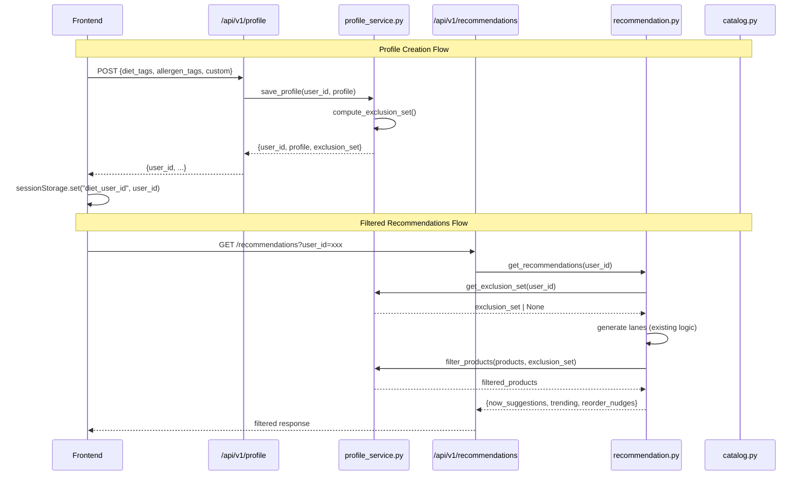
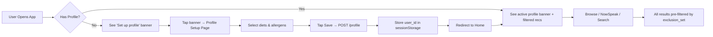

# Design Document: Dietary & Allergy Profile

## Overview

This design introduces a **global personalization layer** for the Amazon Now hackathon MVP that allows users to declare dietary preferences and allergen sensitivities. The system filters, warns, or re-ranks products across all product-surfacing surfaces (Recommendations, NowSpeak AI, Product Search, Shared Cart) using a single shared `Filter_Function`.

**Design Philosophy (Hackathon Constraints):**
- In-memory storage only — mirrors existing Shared Cart architecture
- Single new backend module (`profile_service.py`) — minimal changes to existing services
- Extend existing API endpoints with optional `user_id` parameter rather than creating parallel systems
- Frontend profile stored in `sessionStorage` — no auth required
- Clear MVP/Stretch separation for time-boxed implementation

### Scope Split

| Layer | MVP (Must Demo) | Stretch (If Time) |
|-------|----------------|-------------------|
| Backend | Profile CRUD, Filter_Function, tag mappings | Alternative suggestions, conflict detection |
| Recommendations | Filter all 3 lanes + backfill | Explainable badges |
| NowSpeak | Inject exclusions into search + system prompt | Named restriction in AI reply |
| Search | Filter results by profile | — |
| Shared Cart | — | Allergen warnings on add |
| Frontend | Profile setup page, banner, sessionStorage | Warning badges, filter count, alternatives |

---

## Architecture

### High-Level System Architecture

```mermaid
graph TB
    subgraph Frontend["Frontend (Next.js 15)"]
        PS[Profile Setup Page]
        PB[Profile Banner]
        RF[Recommendation Feed]
        NS[NowSpeak Chat]
        SC[Shared Cart]
        API_LIB[api.ts]
    end

    subgraph Backend["Backend (FastAPI)"]
        subgraph API["API Layer"]
            PROFILE_API["/api/v1/profile"]
            REC_API["/api/v1/recommendations"]
            PROD_API["/api/v1/products"]
            CHAT_API["/api/v1/chat"]
            CART_API["/api/v1/cart"]
        end

        subgraph Services["Service Layer"]
            PROFILE_SVC["profile_service.py<br/>Profile_Store + Filter_Function"]
            REC_SVC["recommendation.py"]
            CAT_SVC["catalog.py"]
            INTENT_SVC["intent_engine.py"]
            CART_SVC["cart_service.py"]
        end
    end

    PS -->|POST profile| API_LIB
    PB -->|GET profile| API_LIB
    RF -->|GET recs + user_id| API_LIB
    NS -->|POST chat + user_id| API_LIB
    SC -->|SSE stream| API_LIB

    API_LIB --> PROFILE_API
    API_LIB --> REC_API
    API_LIB --> PROD_API
    API_LIB --> CHAT_API
    API_LIB --> CART_API

    PROFILE_API --> PROFILE_SVC
    REC_API --> REC_SVC
    REC_SVC -->|get_exclusion_set| PROFILE_SVC
    REC_SVC -->|filter_products| PROFILE_SVC
    PROD_API --> CAT_SVC
    CAT_SVC -->|filter_products| PROFILE_SVC
    CHAT_API --> INTENT_SVC
    INTENT_SVC -->|filter_products| PROFILE_SVC
    CART_API --> CART_SVC
    CART_SVC -.->|check_conflicts (stretch)| PROFILE_SVC
```

### Backend Integration Diagram



---

## Components and Interfaces

### New Files to Create

| File | Purpose |
|------|---------|
| `backend/app/services/profile_service.py` | Core module: Profile_Store + Filter_Function + tag mappings |
| `backend/app/api/profile.py` | FastAPI router for profile CRUD |
| `backend/app/models/profile.py` | Pydantic models for ProfileObject, ExclusionSet |
| `frontend/src/app/profile/page.tsx` | Profile setup page (Next.js route) |
| `frontend/src/components/ProfileBanner/index.tsx` | Home page banner component |
| `frontend/src/hooks/useProfile.ts` | Profile state hook (sessionStorage + API) |
| `frontend/src/lib/profile-api.ts` | Profile API client functions |

### Existing Files to Modify

| File | Change |
|------|--------|
| `backend/app/main.py` | Register `profile.router` |
| `backend/app/services/recommendation.py` | Import and call `filter_products` after generating each lane |
| `backend/app/services/catalog.py` | Add optional `exclusion_set` param to `search_products` |
| `backend/app/services/intent_engine.py` | Retrieve profile, filter results, augment system prompt |
| `backend/app/api/recommendations.py` | Pass `user_id` through to service |
| `backend/app/api/products.py` | Add optional `user_id` query param |
| `frontend/src/app/page.tsx` | Add ProfileBanner, pass user_id to `getRecommendations` |
| `frontend/src/lib/api.ts` | Add `user_id` param to `getRecommendations`, `searchProducts` |
| `frontend/src/components/AmazonHeader/index.tsx` | Add profile icon/link to header |

### Stretch Goal Files (If Time Permits)

| File | Purpose |
|------|---------|
| `backend/app/services/alternatives.py` | Safe alternative suggestion logic |
| `frontend/src/components/WarningBadge/index.tsx` | Allergen warning badge for shared cart |
| `backend/app/services/cart_service.py` | Add conflict detection on `add_item` |

---

## Components and Interfaces — Low-Level Design

### 1. `backend/app/models/profile.py`

```python
from typing import List, Optional, Set
from pydantic import BaseModel


class ProfileObject(BaseModel):
    """User's dietary and allergen preferences."""
    diet_tags: List[str] = []          # e.g., ["vegan", "keto"]
    allergen_tags: List[str] = []      # e.g., ["nuts", "dairy"]
    custom_exclusions: str = ""        # Free-text comma-separated keywords


class ProfileCreateRequest(BaseModel):
    user_id: Optional[str] = None
    profile: ProfileObject


class ProfileResponse(BaseModel):
    user_id: str
    profile: ProfileObject
    exclusion_set: List[str]           # Computed keywords for transparency


class FilteredProduct(BaseModel):
    """Extended product with optional filter metadata (stretch)."""
    # All existing product fields plus:
    filtered_reason: Optional[str] = None
    alternative: Optional[dict] = None
```

### 2. `backend/app/services/profile_service.py` — Core Module

```python
"""
Dietary & Allergy Profile Service.
Single module consumed by all product-surfacing systems.
Architecture: in-memory dict (mirrors cart_service.py pattern).
"""
from __future__ import annotations
import uuid
from typing import Dict, List, Optional, Set

# ── Tag-to-keyword mappings ──────────────────────────────────────────────────

DIET_TAG_EXCLUSIONS: Dict[str, List[str]] = {
    "vegan":       ["milk", "dairy", "egg", "meat", "chicken", "fish",
                    "butter", "cheese", "yogurt", "honey"],
    "vegetarian":  ["meat", "chicken", "fish", "mutton", "pork",
                    "prawn", "shrimp"],
    "keto":        ["sugar", "bread", "rice", "wheat", "flour",
                    "atta", "noodles", "pasta"],
    "halal":       ["pork", "alcohol", "wine", "beer", "rum"],
    "pescatarian": ["meat", "chicken", "mutton", "pork"],
    "gluten-free": ["wheat", "bread", "flour", "atta", "noodles",
                    "pasta", "biscuit", "cookies"],
}

ALLERGEN_TAG_EXCLUSIONS: Dict[str, List[str]] = {
    "nuts":      ["nut", "almond", "cashew", "peanut", "walnut", "pistachio"],
    "gluten":    ["wheat", "bread", "flour", "atta", "noodles",
                  "pasta", "biscuit", "cookies"],
    "dairy":     ["milk", "dairy", "butter", "cheese", "yogurt",
                  "cream", "paneer"],
    "soy":       ["soy", "soya", "tofu"],
    "shellfish": ["prawn", "shrimp", "crab", "lobster", "shellfish"],
    "eggs":      ["egg", "eggs"],
}

# ── In-memory profile store ──────────────────────────────────────────────────

_PROFILES: Dict[str, dict] = {}
# Structure: { user_id: { "profile": {...}, "exclusion_set": set(...) } }


def compute_exclusion_set(
    diet_tags: List[str],
    allergen_tags: List[str],
    custom_exclusions: str = "",
) -> Set[str]:
    """
    Compute the union of all excluded keywords from diet tags,
    allergen tags, and custom exclusions. Pure function.
    """
    keywords: Set[str] = set()

    for tag in diet_tags:
        tag_lower = tag.lower()
        if tag_lower in DIET_TAG_EXCLUSIONS:
            keywords.update(DIET_TAG_EXCLUSIONS[tag_lower])

    for tag in allergen_tags:
        tag_lower = tag.lower()
        if tag_lower in ALLERGEN_TAG_EXCLUSIONS:
            keywords.update(ALLERGEN_TAG_EXCLUSIONS[tag_lower])

    if custom_exclusions.strip():
        for kw in custom_exclusions.split(","):
            cleaned = kw.strip().lower()
            if cleaned:
                keywords.add(cleaned)

    return keywords


def save_profile(user_id: Optional[str], diet_tags: List[str],
                 allergen_tags: List[str], custom_exclusions: str = "") -> dict:
    """Persist a profile in memory. Returns {user_id, profile, exclusion_set}."""
    if not user_id:
        user_id = str(uuid.uuid4())[:8]

    exclusion_set = compute_exclusion_set(diet_tags, allergen_tags, custom_exclusions)

    _PROFILES[user_id] = {
        "profile": {
            "diet_tags": diet_tags,
            "allergen_tags": allergen_tags,
            "custom_exclusions": custom_exclusions,
        },
        "exclusion_set": exclusion_set,
    }

    return {
        "user_id": user_id,
        "profile": _PROFILES[user_id]["profile"],
        "exclusion_set": sorted(exclusion_set),
    }


def get_profile(user_id: str) -> Optional[dict]:
    """Retrieve a stored profile. Returns None if not found."""
    return _PROFILES.get(user_id)


def get_exclusion_set(user_id: Optional[str]) -> Optional[Set[str]]:
    """Get cached exclusion set for a user. Returns None if no profile."""
    if not user_id:
        return None
    entry = _PROFILES.get(user_id)
    return entry["exclusion_set"] if entry else None


def filter_products(products: List[dict], exclusion_set: Optional[Set[str]]) -> List[dict]:
    """
    Core Filter_Function.
    Removes products whose tags contain any keyword from the exclusion_set.
    Case-insensitive substring matching.
    
    Args:
        products: List of product dicts (must have "tags" field)
        exclusion_set: Set of lowercase keywords to exclude
    
    Returns:
        Filtered list of safe products (original order preserved)
    """
    if not exclusion_set:
        return products

    safe: List[dict] = []
    for product in products:
        tags_lower = product.get("tags", "").lower()
        is_excluded = any(keyword in tags_lower for keyword in exclusion_set)
        if not is_excluded:
            safe.append(product)
    return safe


def check_product_conflicts(
    product: dict,
    participant_profiles: Dict[str, Set[str]],
) -> List[dict]:
    """
    (Stretch) Check a product against multiple participants' exclusion sets.
    Returns list of {participant, conflicts: [tag_names]}.
    """
    warnings = []
    tags_lower = product.get("tags", "").lower()

    for participant_id, exclusion_set in participant_profiles.items():
        matched = [kw for kw in exclusion_set if kw in tags_lower]
        if matched:
            warnings.append({
                "participant": participant_id,
                "conflicts": matched,
            })

    return warnings
```

### 3. `backend/app/api/profile.py`

```python
from fastapi import APIRouter, HTTPException
from app.models.profile import ProfileCreateRequest, ProfileResponse
from app.services.profile_service import (
    save_profile, get_profile, DIET_TAG_EXCLUSIONS, ALLERGEN_TAG_EXCLUSIONS
)

router = APIRouter()


@router.post("/profile", response_model=ProfileResponse)
async def create_or_update_profile(body: ProfileCreateRequest):
    """Create or update a dietary profile. Returns user_id for sessionStorage."""
    result = save_profile(
        user_id=body.user_id,
        diet_tags=body.profile.diet_tags,
        allergen_tags=body.profile.allergen_tags,
        custom_exclusions=body.profile.custom_exclusions,
    )
    return result


@router.get("/profile/{user_id}", response_model=ProfileResponse)
async def get_user_profile(user_id: str):
    """Retrieve a stored dietary profile."""
    entry = get_profile(user_id)
    if not entry:
        raise HTTPException(status_code=404, detail="Profile not found")
    return {
        "user_id": user_id,
        "profile": entry["profile"],
        "exclusion_set": sorted(entry["exclusion_set"]),
    }


@router.get("/profile/mappings/diet")
async def get_diet_mappings():
    """Returns all diet tag → exclusion keyword mappings (for frontend display)."""
    return DIET_TAG_EXCLUSIONS


@router.get("/profile/mappings/allergens")
async def get_allergen_mappings():
    """Returns all allergen tag → exclusion keyword mappings."""
    return ALLERGEN_TAG_EXCLUSIONS
```

### 4. Modified `recommendation.py` — Key Changes

```python
# Add to imports:
from app.services.profile_service import get_exclusion_set, filter_products

# Modified get_recommendations function:
def get_recommendations(user_id: str | None = None) -> dict:
    time_ctx = _time_context()
    exclusion_set = get_exclusion_set(user_id)

    # Generate lanes (existing logic)
    now = _now_suggestions(time_ctx)
    trending = get_trending()
    reorder = _reorder_nudges(user_id or "")

    # Apply dietary filter
    now = filter_products(now, exclusion_set)
    trending_filtered = filter_products(trending, exclusion_set)
    reorder = filter_products(reorder, exclusion_set)

    # Backfill if lanes are empty after filtering
    if not now and exclusion_set:
        from app.services.catalog import search_products as cat_search
        backfill = cat_search(query="", category=None, limit=8)
        now = filter_products(backfill, exclusion_set)[:4]

    for p in trending_filtered:
        p["reason"] = "Trending near you 🔥"

    return {
        "time_context":    time_ctx,
        "now_suggestions": now,
        "reorder_nudges":  reorder,
        "trending":        trending_filtered,
    }
```

### 5. Modified `intent_engine.py` — Key Changes

```python
# Add to imports:
from app.services.profile_service import get_exclusion_set, filter_products

# Modified stream_nowspeak — inject filtering after catalog search:
def stream_nowspeak(message, session_id, user_id=None):
    # ... Phase 1: Extract intent (unchanged) ...
    
    # Phase 2: Catalog search + dietary filter
    found_products = _catalog_search(query=intent["query"], category=category, limit=10)
    
    exclusion_set = get_exclusion_set(user_id)
    if exclusion_set:
        found_products = filter_products(found_products, exclusion_set)
        if not found_products:
            # Retry without category restriction
            found_products = _catalog_search(query=intent["query"], category=None, limit=10)
            found_products = filter_products(found_products, exclusion_set)
    
    found_products = found_products[:5]
    
    # Phase 3: Augment system prompt with diet context
    diet_context = ""
    if exclusion_set:
        profile = get_profile(user_id) if user_id else None
        if profile:
            tags = profile["profile"].get("diet_tags", []) + profile["profile"].get("allergen_tags", [])
            diet_context = f"\nThe customer has dietary restrictions: {', '.join(tags)}. Acknowledge this briefly."
    
    reply_system = _REPLY_SYSTEM + diet_context
    # ... rest of streaming logic ...
```

### 6. Modified `catalog.py` — Key Changes

```python
# Add to search_products signature:
def search_products(
    query: str,
    category: str | None = None,
    limit: int = 5,
    exclusion_set: set | None = None,  # NEW
) -> list[dict]:
    # ... existing search logic ...
    results = _search_memory(query, category, limit * 2)  # fetch extra to compensate for filtering
    
    if exclusion_set:
        from app.services.profile_service import filter_products
        results = filter_products(results, exclusion_set)
    
    return results[:limit]
```

### 7. `frontend/src/hooks/useProfile.ts`

```typescript
'use client';
import { useState, useEffect, useCallback } from 'react';

export type ProfileObject = {
  diet_tags: string[];
  allergen_tags: string[];
  custom_exclusions: string;
};

export type ProfileState = {
  userId: string | null;
  profile: ProfileObject | null;
  exclusionSet: string[];
  loading: boolean;
};

const STORAGE_KEY = 'diet_user_id';

export function useProfile() {
  const [state, setState] = useState<ProfileState>({
    userId: null, profile: null, exclusionSet: [], loading: true,
  });

  // Load from sessionStorage on mount
  useEffect(() => {
    const stored = sessionStorage.getItem(STORAGE_KEY);
    if (stored) {
      fetchProfile(stored);
    } else {
      setState(s => ({ ...s, loading: false }));
    }
  }, []);

  const fetchProfile = async (userId: string) => {
    try {
      const res = await fetch(
        `${process.env.NEXT_PUBLIC_API_URL ?? 'http://localhost:8000'}/api/v1/profile/${userId}`
      );
      if (res.ok) {
        const data = await res.json();
        setState({
          userId: data.user_id,
          profile: data.profile,
          exclusionSet: data.exclusion_set,
          loading: false,
        });
      } else {
        sessionStorage.removeItem(STORAGE_KEY);
        setState({ userId: null, profile: null, exclusionSet: [], loading: false });
      }
    } catch {
      setState(s => ({ ...s, loading: false }));
    }
  };

  const saveProfile = useCallback(async (profile: ProfileObject) => {
    const userId = sessionStorage.getItem(STORAGE_KEY);
    const res = await fetch(
      `${process.env.NEXT_PUBLIC_API_URL ?? 'http://localhost:8000'}/api/v1/profile`,
      {
        method: 'POST',
        headers: { 'Content-Type': 'application/json' },
        body: JSON.stringify({ user_id: userId, profile }),
      }
    );
    const data = await res.json();
    sessionStorage.setItem(STORAGE_KEY, data.user_id);
    setState({
      userId: data.user_id,
      profile: data.profile,
      exclusionSet: data.exclusion_set,
      loading: false,
    });
    return data.user_id;
  }, []);

  const clearProfile = useCallback(() => {
    sessionStorage.removeItem(STORAGE_KEY);
    setState({ userId: null, profile: null, exclusionSet: [], loading: false });
  }, []);

  return { ...state, saveProfile, clearProfile };
}
```

### 8. `frontend/src/components/ProfileBanner/index.tsx`

```typescript
'use client';
import { useRouter } from 'next/navigation';

interface Props {
  dietTags: string[];
  allergenTags: string[];
  filteredCount?: number;
  hasProfile: boolean;
}

export function ProfileBanner({ dietTags, allergenTags, filteredCount, hasProfile }: Props) {
  const router = useRouter();

  if (!hasProfile) {
    return (
      <div
        onClick={() => router.push('/profile')}
        style={{
          background: '#FFF8E1', margin: '8px 10px 0', borderRadius: 10,
          padding: '10px 14px', cursor: 'pointer',
          display: 'flex', alignItems: 'center', gap: 10,
          border: '1px solid #FFE082',
        }}
      >
        <span style={{ fontSize: 20 }}>🍽️</span>
        <div style={{ flex: 1 }}>
          <p style={{ margin: 0, fontSize: 13, fontWeight: 600, color: '#0F1111' }}>
            Set up dietary profile
          </p>
          <p style={{ margin: '2px 0 0', fontSize: 11, color: '#666' }}>
            Filter out allergens & dietary restrictions automatically
          </p>
        </div>
        <span style={{ color: '#888', fontSize: 14 }}>›</span>
      </div>
    );
  }

  const allTags = [...dietTags, ...allergenTags];
  return (
    <div
      onClick={() => router.push('/profile')}
      style={{
        background: '#E8F5E9', margin: '8px 10px 0', borderRadius: 10,
        padding: '8px 14px', cursor: 'pointer',
        display: 'flex', alignItems: 'center', gap: 10,
        border: '1px solid #C8E6C9',
      }}
    >
      <span style={{ fontSize: 16 }}>✓</span>
      <div style={{ flex: 1, display: 'flex', flexWrap: 'wrap', gap: 4, alignItems: 'center' }}>
        {allTags.map(tag => (
          <span key={tag} style={{
            background: '#C8E6C9', borderRadius: 12, padding: '2px 8px',
            fontSize: 11, fontWeight: 600, color: '#2E7D32',
          }}>
            {tag}
          </span>
        ))}
        {filteredCount !== undefined && filteredCount > 0 && (
          <span style={{ fontSize: 10, color: '#666', marginLeft: 4 }}>
            · {filteredCount} items filtered
          </span>
        )}
      </div>
      <span style={{ color: '#888', fontSize: 12 }}>Edit ›</span>
    </div>
  );
}
```

---

## Data Models

### Profile_Object (Backend — In-Memory)

```python
# Key: user_id (str) → Value:
{
    "profile": {
        "diet_tags": ["vegan", "keto"],       # List[str]
        "allergen_tags": ["nuts", "dairy"],    # List[str]
        "custom_exclusions": "aspartame"       # str (comma-separated)
    },
    "exclusion_set": {"milk", "dairy", "egg", "meat", ...}  # Set[str] — computed cache
}
```

### Profile_Object (Frontend — sessionStorage)

```typescript
// sessionStorage key: "diet_user_id" → value: "abc12345"
// The profile itself is NOT stored client-side — always fetched from backend via user_id
```

### Exclusion_Set Computation

```
exclusion_set = ∪(DIET_TAG_EXCLUSIONS[tag] for tag in diet_tags)
              ∪ ∪(ALLERGEN_TAG_EXCLUSIONS[tag] for tag in allergen_tags)
              ∪ {kw.strip().lower() for kw in custom_exclusions.split(",")}
```

### Product Filtering Logic

```
product_is_safe(product, exclusion_set) =
    ∀ keyword ∈ exclusion_set: keyword ∉ product.tags.lower()
```

Where `∉` means "is not a substring of" (case-insensitive).

---

## Data Flow

### User Journey



### UI Flow (Screen-by-Screen)

1. **Home Page** → Profile Banner (green if active, yellow CTA if not)
2. **Profile Setup** → Grid of diet pills + allergen pills + text input + Save button
3. **Home Feed** → Filtered recommendations (unsafe products removed)
4. **NowSpeak** → AI acknowledges restrictions, only suggests safe products
5. **Product Search** → Results filtered, only safe products shown
6. **Shared Cart** (stretch) → Warning badges on conflicting items

---

## Correctness Properties

*A property is a characteristic or behavior that should hold true across all valid executions of a system — essentially, a formal statement about what the system should do. Properties serve as the bridge between human-readable specifications and machine-verifiable correctness guarantees.*

### Property 1: Profile persistence round-trip

*For any* valid ProfileObject (with any combination of diet_tags, allergen_tags, and custom_exclusions), saving the profile and then retrieving it by the returned user_id SHALL produce an equivalent ProfileObject.

**Validates: Requirements 1.1, 1.4, 1.5**

### Property 2: Exclusion_Set computation correctness

*For any* valid combination of diet_tags (drawn from the predefined set), allergen_tags (drawn from the predefined set), and arbitrary custom exclusion strings, the computed Exclusion_Set SHALL be exactly the union of all mapped keywords from DIET_TAG_EXCLUSIONS for each diet_tag, all mapped keywords from ALLERGEN_TAG_EXCLUSIONS for each allergen_tag, and all comma-separated trimmed lowercase tokens from the custom exclusions string.

**Validates: Requirements 1.3, 8.1, 8.2, 8.3, 8.4, 8.5, 8.6**

### Property 3: Exclusion_Set computation idempotence

*For any* valid ProfileObject, computing the Exclusion_Set and then computing it again from the same inputs SHALL produce an identical set (the computation is deterministic and idempotent).

**Validates: Requirements 8.7**

### Property 4: Filter completeness — no excluded product passes

*For any* list of products and *any* non-empty Exclusion_Set, every product in the output of `filter_products` SHALL have a tags field that does not contain any keyword from the Exclusion_Set as a case-insensitive substring.

**Validates: Requirements 2.1, 2.2, 2.3, 2.5, 4.1, 11.2**

### Property 5: Filter preserves safe products

*For any* list of products and *any* Exclusion_Set, every product whose tags field does NOT contain any keyword from the Exclusion_Set as a case-insensitive substring SHALL appear in the output of `filter_products` (no false positives in filtering).

**Validates: Requirements 2.5, 4.2**

### Property 6: Filter statelessness

*For any* product list and *any* Exclusion_Set, calling `filter_products(products, exclusion_set)` SHALL produce the same output regardless of how many times it is called or what other operations have been performed between calls (pure function behavior).

**Validates: Requirements 11.5**

### Property 7: Profile update overwrites previous state

*For any* two distinct ProfileObjects stored under the same user_id, retrieving the profile after the second save SHALL always return the second ProfileObject, never the first.

**Validates: Requirements 1.5**

---

## Error Handling

| Scenario | Handling |
|----------|----------|
| Profile not found for user_id | Return `None` exclusion_set → no filtering applied (graceful degradation) |
| Invalid diet_tag name | Silently skip unknown tags — only known tags produce exclusions |
| Empty exclusion_set after computation | Treat as "no profile" — return all products unfiltered |
| All products filtered from a recommendation lane | Backfill from broader catalog with filter still applied |
| NowSpeak search returns 0 products after filter | Retry without category restriction, still applying exclusion filter |
| sessionStorage unavailable (private browsing) | Catch exception, treat as no profile — feature gracefully disabled |
| Backend profile_service unreachable from frontend | Show banner as "Set up profile" state — no crash |
| Malformed custom_exclusions string | Split by comma, trim whitespace, skip empty tokens |

---

## Testing Strategy

### Property-Based Testing (PBT)

This feature is well-suited for property-based testing because the core logic is **pure functions** with clear input/output behavior (Exclusion_Set computation, product filtering) that should hold universal properties across a large input space.

**Library:** `hypothesis` (Python) — the standard PBT library for Python.

**Configuration:** Each property test runs a minimum of **100 iterations** with randomly generated inputs.

**Tag format:** Each test is annotated with:
```python
# Feature: dietary-allergy-profile, Property {N}: {property_text}
```

### Test Plan

| Type | What | Coverage |
|------|------|----------|
| Property tests | `filter_products` correctness, `compute_exclusion_set` correctness, profile round-trip, idempotence, statelessness | Requirements 1, 2, 4, 8, 11 |
| Unit tests (examples) | Profile creation without user_id, mapping verification, API endpoint responses | Requirements 1.2, 6, 7, 8 |
| Integration tests | Recommendation filtering end-to-end, NowSpeak with profile, search with profile | Requirements 2, 3, 4 |
| Smoke tests | Static mappings exist, module imports without circular deps | Requirements 8, 11.3 |
| Frontend component tests | Profile setup page renders all options, banner shows correct state | Requirements 6, 7 |

### Unit Tests (Example-Based)

- Profile creation returns generated user_id when none provided
- Profile setup page displays all 6 diet options and 6 allergen options
- ProfileBanner renders "Set up" prompt when no profile exists
- ProfileBanner renders pill chips when profile is active
- API returns 404 for unknown user_id

### Integration Tests

- POST /profile → GET /recommendations filters correctly
- NowSpeak chat with profile filters product cards
- Product search with user_id returns only safe products
- Shared cart add triggers conflict warnings (stretch)

---

## Risk Assessment

| Risk | Impact | Likelihood | Mitigation |
|------|--------|------------|------------|
| In-memory store lost on server restart | Medium | High (dev) | Expected for hackathon — data is ephemeral by design |
| Overly aggressive filtering (user sees empty results) | High | Medium | Backfill logic + broader retry in NowSpeak + "Show All" escape hatch |
| Substring matching false positives (e.g., "butter" matches "butterscotch") | Low | Medium | Acceptable for demo — refine to word-boundary matching post-hackathon |
| Profile not passed to API calls (frontend bug) | High | Low | Single `useProfile` hook centralizes user_id propagation |
| Performance with large catalog + large exclusion set | Low | Low | Linear scan over 3.8K products × ~20 keywords ≈ 76K comparisons — negligible |
| NowSpeak AI doesn't naturally acknowledge diet in reply | Medium | Medium | Explicit system prompt injection ensures acknowledgment |
| sessionStorage cleared (private browsing) | Low | Medium | Graceful degradation — feature simply not active |

---

## Implementation Sequence

### Phase 1: Core Backend (Est. 2-3 hours)
1. Create `profile_service.py` with mappings, store, compute, filter
2. Create `models/profile.py` with Pydantic models
3. Create `api/profile.py` router + register in `main.py`
4. Add `filter_products` call to `recommendation.py`
5. Add `user_id` param to `products.py` search endpoint + wire to `catalog.py`

### Phase 2: Frontend Profile UI (Est. 2-3 hours)
6. Create `useProfile.ts` hook
7. Create `/profile` page with tag grid + save
8. Create `ProfileBanner` component
9. Integrate banner into `page.tsx`
10. Pass `user_id` to `getRecommendations` and `searchProducts` calls

### Phase 3: NowSpeak Integration (Est. 1-2 hours)
11. Modify `intent_engine.py` to retrieve profile + filter + augment prompt
12. Pass `user_id` through chat API call from frontend

### Phase 4: Stretch Goals (If Time Permits)
13. Shared Cart allergen warnings
14. Safe alternative suggestions
15. Explainable badges / filter count
